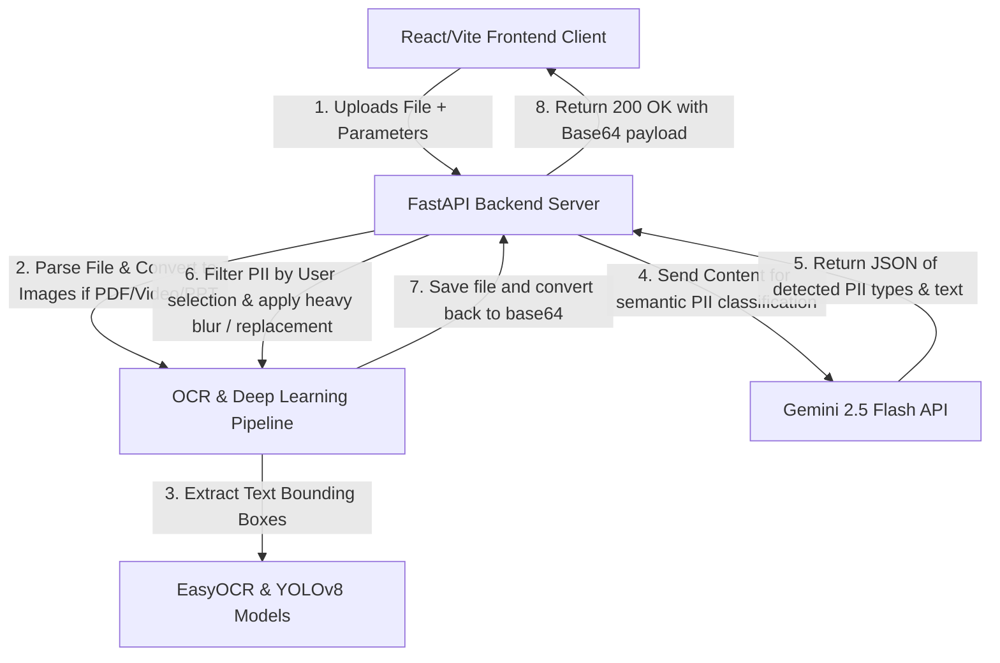
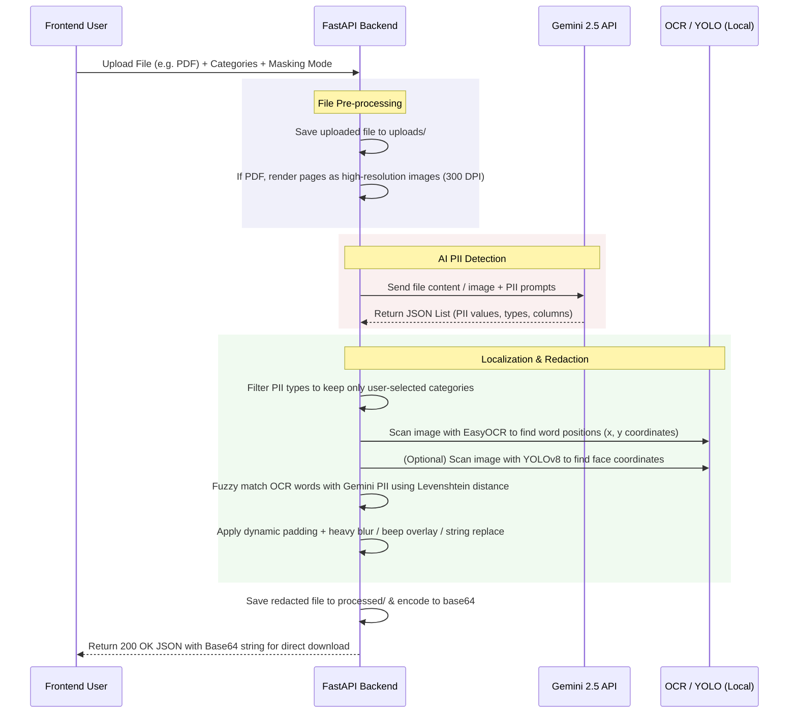

# PII Masking & Redaction System: Developer's Guide

Welcome to the comprehensive technical documentation for the **PII Masking & Redaction System**. This guide is designed to take you from a high-level conceptual understanding of the project to an advanced code-level analysis.

---

## 1. Project Overview & Concepts

### What is PII?
**Personally Identifiable Information (PII)** is any data that can be used to distinguish or trace an individual's identity. Examples include:
*   **Direct Identifiers:** Names, contact numbers, email addresses.
*   **Indirect Identifiers:** Aadhaar card/SSN numbers, PAN card numbers, bank account numbers, physical addresses.

### What is Masking/Redaction?
Masking (or redacting) is the process of obscuring or replacing sensitive data within a file to protect user privacy before sharing or storing it. Our system supports three masking modes:
1.  **Blurring:** Applying visual filters to images/videos to render names, faces, or IDs unreadable.
2.  **Replacement:** Replacing sensitive text with generic tags like `[MASKED]`.
3.  **Named Replacement:** Replacing sensitive text with its category label, e.g., replacing "Yatharth" with `[Full Name]`.

---

## 2. System Architecture

The project consists of a modern **Single Page Application (SPA)** frontend communicating with a high-performance **REST API** backend.



### Technology Stack
*   **Frontend:** React, TypeScript, TailwindCSS, Vite.
*   **Backend:** FastAPI (Python), Uvicorn (ASGI web server).
*   **AI & Computer Vision:**
    *   **Google Gemini 2.5 Flash:** Cloud LLM used for multi-modal semantic detection of PII.
    *   **YOLOv8 Nano:** Local lightweight deep learning model used for real-time face detection.
    *   **EasyOCR:** Local OCR engine used to locate coordinates of words on page images.
    *   **OpenCV (cv2):** Used for advanced image manipulation and rendering the visual blur overlays.

---

## 3. Step-by-Step Processing Pipeline

Every file uploaded to the `/upload/` endpoint follows this sequential lifecycle:



---

## 4. Key Engineering Implementations

### A. Gemini Rate-Limit Handling (Exponential Backoff)
Free-tier Gemini API keys are restricted to low Rate Limits (e.g., 15 RPM). To prevent processing failures on multi-page PDFs or videos, we wrap all Gemini calls in an exponential backoff retry loop.

Located in [gemini_utils.py](file:///d:/pii%20masking/pii-masking-backend-main/src/utils/gemini_utils.py#L4-L32):
```python
def generate_content_with_retry(client: Client, model: str, contents, **kwargs):
    max_retries = kwargs.pop('max_retries', 5)
    initial_backoff = kwargs.pop('initial_backoff', 2)
    backoff = initial_backoff
    
    for attempt in range(max_retries):
        try:
            return client.models.generate_content(model=model, contents=contents, **kwargs)
        except Exception as e:
            err_msg = str(e).lower()
            if "429" in err_msg or "resource_exhausted" in err_msg or "rate limit" in err_msg:
                if attempt == max_retries - 1:
                    raise e
                time.sleep(backoff)
                backoff *= 2  # Double the wait time for the next retry
            else:
                raise e
```

### B. High-DPI PDF Rendering
By default, rendering PDF pages as images using PyMuPDF (`fitz`) exports them at 72 DPI. At this resolution, small text (such as student names on receipts) is too small and blurry for the OCR engine to detect. 

We resolve this in [pdf_utils.py](file:///d:/pii%20masking/pii-masking-backend-main/src/utils/pdf_utils.py#L14-L25) by applying a zoom matrix to render pages at **300 DPI**:
```python
zoom = 300 / 72
matrix = fitz.Matrix(zoom, zoom)
images = [page.get_pixmap(matrix=matrix) for page in doc]
```
This increases the height/width of the page image by **4.16x**, ensuring that text is sharp, clear, and perfectly readable by OCR.

### C. Advanced Heavy Blurring Mechanism
Standard Gaussian blurs are easily readable if the resolution is high. To make text **mathematically unreadable**, we use a combination of **pixelation/downsampling** and **Gaussian smoothing** in [image_utils.py](file:///d:/pii%20masking/pii-masking-backend-main/src/utils/image_utils.py#L97-L122):

```python
def heavy_blur_roi(roi):
    h, w = roi.shape[:2]
    if h <= 0 or w <= 0:
        return roi
    # 1. Scale down the region to 10% of its size (physically destroys text details)
    scale = 0.1
    small_w = max(4, int(w * scale))
    small_h = max(4, int(h * scale))
    small_roi = cv2.resize(roi, (small_w, small_h), interpolation=cv2.INTER_LINEAR)
    
    # 2. Resize it back to its original dimensions (creates soft blocky shapes)
    pixelated = cv2.resize(small_roi, (w, h), interpolation=cv2.INTER_LINEAR)
    
    # 3. Apply a light Gaussian Blur to smooth out interpolation artifacts
    k_w = max(5, (int(w * 0.1) | 1))
    k_h = max(5, (int(h * 0.1) | 1))
    return cv2.GaussianBlur(pixelated, (k_w, k_h), 0)
```

### D. Dynamic Border Padding
OCR word coordinates can sometimes crop text tightly, leaving edge details (like the tails of "y" or "g") visible outside the blur boundaries. We compute a **10% + 2px padding** around the matched coordinate boxes to cover text borders fully:
```python
padding_x = int((x_max - x_min) * 0.1) + 2
padding_y = int((y_max - y_min) * 0.1) + 2
x_min_pad = max(0, x_min - padding_x)
y_min_pad = max(0, y_min - padding_y)
x_max_pad = min(image.shape[1], x_max + padding_x)
y_max_pad = min(image.shape[0], y_max + padding_y)
```

### E. Backend PII Category Filtering
To avoid redacting unintended fields (e.g. Challan Numbers when only "Name" is selected), we use a normalization and partial-match filtering function to clean up the user-selected list:
```python
def filter_pii_by_categories(detected_pii: list, pii_category_str: str) -> list:
    # Converts category string e.g. "name, contact_number" into a normalized list
    # Matches with Gemini's returned 'type' field while skipping ID fields if name-only is chosen
    ...
```

---

## 5. File-by-File Walkthrough

### 1. [main.py](file:///d:/pii%20masking/pii-masking-backend-main/src/main.py)
The entry point of the FastAPI application. Sets up CORS, configures endpoints (`/upload/`, `/healthcheck`), parses file extensions, calls the respective utility modules, and translates processed files into Base64 format for safe client delivery.

### 2. [gemini_utils.py](file:///d:/pii%20masking/pii-masking-backend-main/src/utils/gemini_utils.py)
Contains core wrappers for calling the Google GenAI SDK with exponential retry backoff, and provides `filter_pii_by_categories` for cleaning detected PII lists before blurring.

### 3. [image_utils.py](file:///d:/pii%20masking/pii-masking-backend-main/src/utils/image_utils.py)
The visual processor. Combines EasyOCR for word detection, YOLOv8 for face detection, Levenshtein distance for fuzzy matching, and OpenCV for pixelated heavy-blur rendering.

### 4. [pdf_utils.py](file:///d:/pii%20masking/pii-masking-backend-main/src/utils/pdf_utils.py)
Processes PDF files. It uses PyMuPDF (`fitz`) to split PDFs into high-resolution 300 DPI page images, forwards each page to `process_image`, and recompiles them back into a single output PDF.

### 5. [docx_utils.py](file:///d:/pii%20masking/pii-masking-backend-main/src/utils/docx_utils.py)
Uses the `docx` library to parse Word document structures. Replaces the inner text of matched paragraphs with the selected mask replacements.

### 6. [csv_utils.py](file:///d:/pii%20masking/pii-masking-backend-main/src/utils/csv_utils.py)
Uses `pandas` to read spreadsheet cells (CSV/Excel), queries Gemini to understand column-level relationships, and sanitizes matched columns cell-by-cell.

### 7. [audio_utils.py](file:///d:/pii%20masking/pii-masking-backend-main/src/utils/audio_utils.py)
Transcribes files with Gemini, gets precise word timestamps, and uses `pydub` to mute or overlay a sine-wave beep on matching portions of the timeline.

### 8. [video_utils.py](file:///d:/pii%20masking/pii-masking-backend-main/src/utils/video_utils.py)
Extracts video frames using `cv2.VideoCapture`, runs OCR and YOLO face-masking on each frame in a multi-threaded pool for optimization, and compiles them back with `ffmpeg`.
