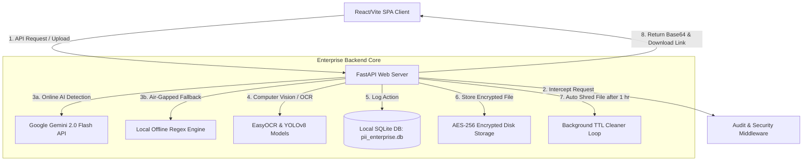
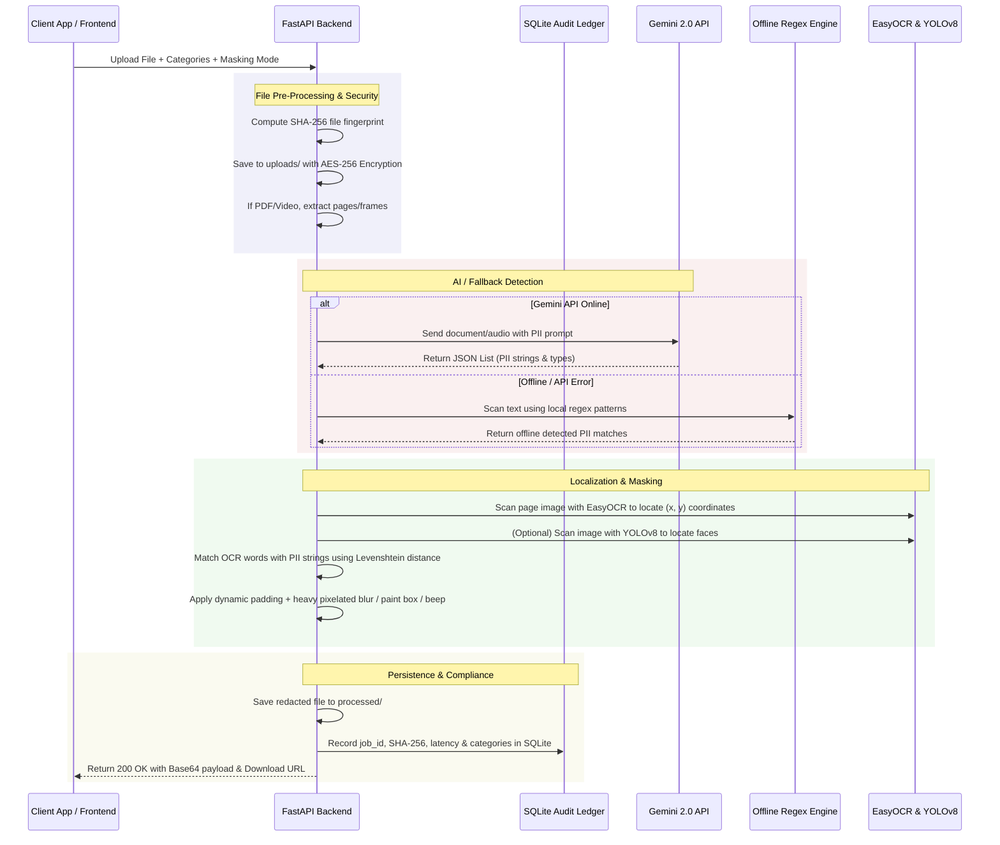

# PII Masking & Redaction System: Enterprise Developer's Guide

Welcome to the comprehensive technical documentation for the **PII Shield Enterprise System**. This guide is designed to take you from a high-level conceptual understanding of the project to an advanced code-level and architectural analysis.

---

## 1. Project Overview & Concepts

### What is PII?
**Personally Identifiable Information (PII)** is any data that can be used to distinguish or trace an individual's identity. Examples include:
*   **Direct Identifiers:** Names, contact numbers, email addresses.
*   **Indirect Identifiers:** SSN / Aadhaar numbers, PAN card numbers, bank account numbers, IP addresses, physical addresses.

### What is Masking/Redaction?
Masking (or redacting) is the process of obscuring or replacing sensitive data within a file to protect user privacy before sharing or storing it. Our system supports multiple redaction modes:
1.  **Soft Blurring:** Applying pixelation + Gaussian filters to images/videos to render text and faces mathematically unreadable.
2.  **Solid Paint BBox:** Overlaying opaque solid rectangles over sensitive areas.
3.  **General Replacement:** Replacing sensitive text with generic placeholders like `[MASKED]`.
4.  **Named Replacement:** Replacing sensitive text with its category label, e.g., replacing "Yatharth" with `[Full Name]`.
5.  **X-Character Mapping:** Preserving character length while redacting (e.g., replacing names with `XXXXXX`).
6.  **Audio Beeping:** Overlaying a sine-wave frequency tone on audio timestamps containing sensitive words.

---

## 2. Enterprise System Architecture

The project consists of a modern **React + TypeScript SPA frontend** communicating with a high-performance **FastAPI REST API backend**, backed by an embedded **SQLite Database**, **AES-256 Storage Encryption**, **Async TTL Shredding Daemon**, and an **Air-Gapped Local Fallback Engine**.


```mermaid
graph TD
    A[React/Vite SPA Client] -- 1. API Request / Upload --> B[FastAPI Web Server]
    B -- 2. Intercept Request --> M[Audit & Security Middleware]
    
    subgraph Enterprise Backend Core
        B -- 3a. Online AI Detection --> E[Google Gemini 2.0 Flash API]
        B -- 3b. Air-Gapped Fallback --> F[Local Offline Regex Engine]
        B -- 4. Computer Vision / OCR --> D[EasyOCR & YOLOv8 Models]
        B -- 5. Log Action --> DB[(Local SQLite DB: pii_enterprise.db)]
        B -- 6. Store Encrypted File --> S[AES-256 Encrypted Disk Storage]
        B -- 7. Auto Shred File after 1 hr --> T[Background TTL Cleaner Loop]
    end

    B -- 8. Return Base64 & Download Link --> A
```

### Technology Stack & Architecture
*   **Frontend:** React 19, TypeScript 5.9, TailwindCSS, Vite.
*   **Backend Framework:** FastAPI (Python 3.11+), Uvicorn (ASGI web server).
*   **Database & Persistence:** SQLite3 (Local file-based DB `pii_enterprise.db`).
*   **Security & Encryption:** Cryptography (Fernet AES-256 stream encryption), SHA-256 Hashing, API Key headers.
*   **AI & Computer Vision:**
    *   **Google Gemini 2.0 Flash:** Multimodal LLM for context-aware semantic PII detection.
    *   **YOLOv8 Nano:** Real-time deep learning single-pass CNN model for face detection.
    *   **EasyOCR / PaddleOCR:** Local OCR engines for word bounding box localization (`x, y, w, h`).
    *   **OpenCV (`cv2`):** High-speed image and video frame manipulation.

---

## 3. Step-by-Step Processing Pipeline

Every file uploaded to `/upload/` or `/api/v1/batch` follows this enterprise lifecycle:


```mermaid
sequenceDiagram
    participant User as Client App / Frontend
    participant API as FastAPI Backend
    participant Audit as SQLite Audit Ledger
    participant Gemini as Gemini 2.0 API
    participant Fallback as Offline Regex Engine
    participant Local as EasyOCR & YOLOv8

    User->>API: Upload File + Categories + Masking Mode
    rect rgb(240, 240, 250)
        note over API: File Pre-Processing & Security
        API->>API: Compute SHA-256 file fingerprint
        API->>API: Save to uploads/ with AES-256 Encryption
        API->>API: If PDF/Video, extract pages/frames
    end
    
    rect rgb(250, 240, 240)
        note over API, Gemini: AI / Fallback Detection
        alt Gemini API Online
            API->>Gemini: Send document/audio with PII prompt
            Gemini-->>API: Return JSON List (PII strings & types)
        else Offline / API Error
            API->>Fallback: Scan text using local regex patterns
            Fallback-->>API: Return offline detected PII matches
        end
    end

    rect rgb(240, 250, 240)
        note over API, Local: Localization & Masking
        API->>Local: Scan page image with EasyOCR to locate (x, y) coordinates
        API->>Local: (Optional) Scan image with YOLOv8 to locate faces
        API->>API: Match OCR words with PII strings using Levenshtein distance
        API->>API: Apply dynamic padding + heavy pixelated blur / paint box / beep
    end

    rect rgb(250, 250, 240)
        note over API, Audit: Persistence & Compliance
        API->>API: Save redacted file to processed/
        API->>Audit: Record job_id, SHA-256, latency & categories in SQLite
        API-->>User: Return 200 OK with Base64 payload & Download URL
    end
```

---

## 4. Key Engineering Implementations

### A. Gemini Rate-Limit Handling (Exponential Backoff)
Free-tier Gemini API keys are restricted to low Rate Limits (e.g., 15 RPM). To prevent processing failures on multi-page PDFs or videos, we wrap all Gemini calls in an exponential backoff retry loop in [gemini_utils.py](file:///d:/pii%20masking/pii-masking-backend-main/src/utils/gemini_utils.py#L4-L32):

```python
def generate_content_with_retry(client: Client, model: str, contents, **kwargs):
    max_retries = kwargs.pop('max_retries', 5)
    initial_backoff = kwargs.pop('initial_backoff', 2)
    backoff = initial_backoff
    
    for attempt in range(max_retries):
        try:
            return client.models.generate_content(model=model, contents=contents, **kwargs)
        except Exception as e:
            err_msg = str(e).lower()
            if "429" in err_msg or "resource_exhausted" in err_msg or "rate limit" in err_msg:
                if attempt == max_retries - 1:
                    raise e
                time.sleep(backoff)
                backoff *= 2  # Double wait time for next retry
            else:
                raise e
```

### B. Immutable Local SQLite Audit Ledger
Located in [database.py](file:///d:/pii%20masking/pii-masking-backend-main/src/db/database.py). Every redaction event records job details into SQLite for compliance auditing:

```python
def add_audit_log(filename: str, file_hash: str, pii_categories: List[str], masking_type: str, processing_time_ms: float = 0, file_size: int = 0, status: str = "SUCCESS"):
    conn = get_db_connection()
    cursor = conn.cursor()
    cursor.execute("""
        INSERT INTO audit_logs (timestamp, filename, file_hash, pii_categories, masking_type, status, processing_time_ms, file_size_bytes)
        VALUES (?, ?, ?, ?, ?, ?, ?, ?)
    """, (datetime.utcnow().isoformat(), filename, file_hash, json.dumps(pii_categories), masking_type, status, processing_time_ms, file_size))
    conn.commit()
    conn.close()
```

### C. Automatic File Shredder (TTL Cleaner Loop)
Located in [ttl_cleaner.py](file:///d:/pii%20masking/pii-masking-backend-main/src/services/ttl_cleaner.py). Runs periodically as an async background task to enforce zero-retention policies:

```python
async def run_ttl_cleanup_loop():
    while True:
        now = time.time()
        ttl = settings.FILE_TTL_SECONDS
        for folder in [UPLOAD_DIR, PROCESSED_DIR]:
            if os.path.exists(folder):
                for fname in os.listdir(folder):
                    fpath = os.path.join(folder, fname)
                    if os.path.isfile(fpath) and (now - os.path.getmtime(fpath)) > ttl:
                        os.remove(fpath)
        await asyncio.sleep(60)
```

### D. Advanced Heavy Blurring Mechanism
Standard Gaussian blurs can be un-blurred using deconvolution algorithms. To make text **mathematically un-recoverable**, we combine downsampling/pixelation with Gaussian smoothing in [image_utils.py](file:///d:/pii%20masking/pii-masking-backend-main/src/utils/image_utils.py#L97-L122):

```python
def heavy_blur_roi(roi):
    h, w = roi.shape[:2]
    if h <= 0 or w <= 0:
        return roi
    # 1. Downsample region to 10% size (physically destroys text pixel details)
    small_w, small_h = max(4, int(w * 0.1)), max(4, int(h * 0.1))
    small_roi = cv2.resize(roi, (small_w, small_h), interpolation=cv2.INTER_LINEAR)
    
    # 2. Resize back to original size (creates soft blocky shapes)
    pixelated = cv2.resize(small_roi, (w, h), interpolation=cv2.INTER_LINEAR)
    
    # 3. Apply Gaussian Blur to smooth block edges
    k_w = max(5, (int(w * 0.1) | 1))
    k_h = max(5, (int(h * 0.1) | 1))
    return cv2.GaussianBlur(pixelated, (k_w, k_h), 0)
```

---

## 5. End-to-End Interview Preparation

For an exhaustive 35-question deep dive into every scenario, tech choice, scaling architecture, and compliance standard, refer to the root guide:
👉 **[Master Interview Q&A Guide (`INTERVIEW_QA.md`)](file:///d:/pii%20masking/INTERVIEW_QA.md)**

### Key Topics Covered in Master Interview Guide:
- **Pillar 1**: Project Overview & Regulations (GDPR, HIPAA, CCPA, SOC 2)
- **Pillar 2**: Tech Stack Choices (FastAPI, React+Vite, Gemini 2.0, YOLOv8, EasyOCR, SQLite, Fernet AES-256)
- **Pillar 3**: Per-Format Pipelines (Images, PDFs 300 DPI, Audio `pydub` beeping, Parallel Video Thread Pools, Word/PPT XML, 100K-row CSV sampling)
- **Pillar 4**: Enterprise Security (Air-Gapped Offline Fallback, Async TTL Cleaner, Audit Exporter, API Keys)
- **Pillar 5**: Production System Design (500-page PDF Async Queue, Scaling to 1M files/day on K8s/Celery/S3, Levenshtein matching, Monorepo vs Polyrepo)
- **Pillar 6**: Quality & Operations (Gitleaks, Ruff, Bandit, Semgrep, Pytest)
- **Pillar 7**: Top 10 Memory Anchors & Key Interview Numbers (300 DPI, 85% ratio, $10\%+2\text{px}$ padding, 3600s TTL)
