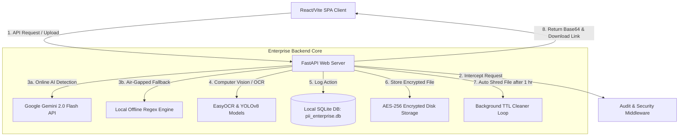
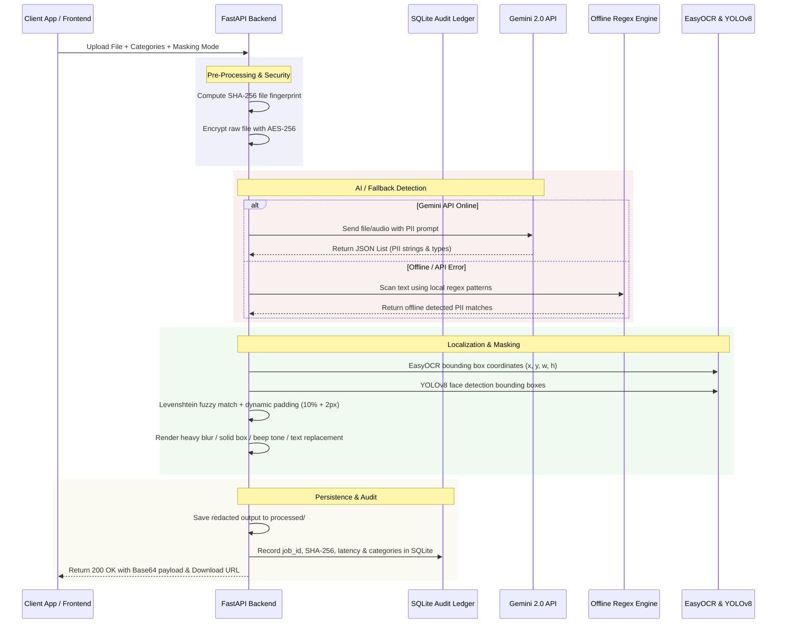

# PII Masking & Redaction System: Enterprise Developer's Guide

Welcome to the comprehensive technical documentation for the **PII Shield Enterprise System**. This guide provides an end-to-end conceptual, architectural, and code-level walkthrough of both the core PII processing engines and all **Production/Enterprise features** built into the application.

---

## 📑 Table of Contents
1. [Project Overview & Core Concepts](#1-project-overview--concepts)
2. [Enterprise System Architecture & Diagrams](#2-enterprise-system-architecture)
3. [Step-by-Step Request Lifecycle & Pipeline](#3-step-by-step-processing-pipeline)
4. [Enterprise Production Features: Deep-Dive Code Analysis](#4-enterprise-production-features-deep-dive-code-analysis)
   - [4.1 Local SQLite Database Layer (`src/db/database.py`)](#41-local-sqlite-database-layer-srcdbdatabasepy)
   - [4.2 AES-256 Storage Encryption & Security (`src/core/security.py`)](#42-aes-256-storage-encryption--security-srccoresecuritypy)
   - [4.3 Async TTL File Shredder Daemon (`src/services/ttl_cleaner.py`)](#43-async-ttl-file-shredder-daemon-srcservicesttl_cleanerpy)
   - [4.4 Air-Gapped Offline Fallback Engine (`src/services/fallback_engine.py`)](#44-air-gapped-offline-fallback-engine-srcservicesfallback_enginepy)
   - [4.5 Compliance Exporter (`src/services/compliance_reporter.py`)](#45-compliance-exporter-srcservicescompliance_reporterpy)
   - [4.6 Middleware & API Key Auth (`src/middleware/`)](#46-middleware--api-key-auth-srcmiddleware)
   - [4.7 Enterprise REST API Router (`src/api/v1/router.py`)](#47-enterprise-rest-api-router-srcapiv1routerpy)
5. [Frontend Enterprise Workspace Walkthrough](#5-frontend-enterprise-workspace-walkthrough)
6. [Core Masking Utilities Engineering Details](#6-core-masking-utilities-engineering-details)
7. [Master Interview Q&A Guide Reference](#7-master-interview-qa-guide-reference)

---

## 1. Project Overview & Concepts

### What is PII?
**Personally Identifiable Information (PII)** is any data that can be used to distinguish or trace an individual's identity.
*   **Direct Identifiers:** Names, contact numbers, email addresses.
*   **Indirect Identifiers:** SSN / Aadhaar numbers, PAN card numbers, bank account numbers, IP addresses, physical addresses.

### Redaction Modes Supported
1.  **Soft Blurring:** Downsampling + Gaussian filtering on images/videos to render text and faces mathematically unreadable.
2.  **Solid Paint BBox:** Overlaying opaque solid rectangles over sensitive regions.
3.  **General Replacement:** Replacing sensitive text with generic tags like `[MASKED]`.
4.  **Named Replacement:** Replacing text with category labels (e.g., replacing "Yatharth" with `[Full Name]`).
5.  **X-Character Mapping:** Preserving character length while redacting (e.g., "John" $\rightarrow$ `XXXX`).
6.  **Audio Beeping:** Overlaying a 300 Hz sine-wave beep tone over sensitive audio timestamps.

---

## 2. Enterprise System Architecture

The system consists of a modern **React + TypeScript SPA frontend** communicating with a high-performance **FastAPI REST API backend**, backed by an embedded **SQLite Database**, **AES-256 Storage Encryption**, **Async TTL Shredding Daemon**, and an **Air-Gapped Local Fallback Engine**.


```mermaid
graph TD
    A[React/Vite SPA Client] -- 1. API Request / Upload --> B[FastAPI Web Server]
    B -- 2. Intercept Request --> M[Audit & Security Middleware]
    
    subgraph Enterprise Backend Core
        B -- 3a. Online AI Detection --> E[Google Gemini 2.0 Flash API]
        B -- 3b. Air-Gapped Fallback --> F[Local Offline Regex Engine]
        B -- 4. Computer Vision / OCR --> D[EasyOCR & YOLOv8 Models]
        B -- 5. Log Action --> DB[(Local SQLite DB: pii_enterprise.db)]
        B -- 6. Store Encrypted File --> S[AES-256 Encrypted Disk Storage]
        B -- 7. Auto Shred File after 1 hr --> T[Background TTL Cleaner Loop]
    end

    B -- 8. Return Base64 & Download Link --> A
```

---

## 3. Step-by-Step Processing Pipeline


```mermaid
sequenceDiagram
    participant User as Client App / Frontend
    participant API as FastAPI Backend
    participant Audit as SQLite Audit Ledger
    participant Gemini as Gemini 2.0 API
    participant Fallback as Offline Regex Engine
    participant Local as EasyOCR & YOLOv8

    User->>API: Upload File + Categories + Masking Mode
    rect rgb(240, 240, 250)
        note over API: Pre-Processing & Security
        API->>API: Compute SHA-256 file fingerprint
        API->>API: Encrypt raw file with AES-256
    end
    
    rect rgb(250, 240, 240)
        note over API, Gemini: AI / Fallback Detection
        alt Gemini API Online
            API->>Gemini: Send file/audio with PII prompt
            Gemini-->>API: Return JSON List (PII strings & types)
        else Offline / API Error
            API->>Fallback: Scan text using local regex patterns
            Fallback-->>API: Return offline detected PII matches
        end
    end

    rect rgb(240, 250, 240)
        note over API, Local: Localization & Masking
        API->>Local: EasyOCR bounding box coordinates (x, y, w, h)
        API->>Local: YOLOv8 face detection bounding boxes
        API->>API: Levenshtein fuzzy match + dynamic padding (10% + 2px)
        API->>API: Render heavy blur / solid box / beep tone / text replacement
    end

    rect rgb(250, 250, 240)
        note over API, Audit: Persistence & Audit
        API->>API: Save redacted output to processed/
        API->>Audit: Record job_id, SHA-256, latency & categories in SQLite
        API-->>User: Return 200 OK with Base64 payload & Download URL
    end
```

---

## 4. Enterprise Production Features: Deep-Dive Code Analysis

### 4.1 Local SQLite Database Layer (`src/db/database.py`)
Provides zero-configuration local ACID database persistence. Automatically creates tables on application startup via `init_db()`:
- `audit_logs`: Stores `id`, `timestamp`, `filename`, `file_hash`, `pii_categories`, `masking_type`, `status`, `processing_time_ms`, `file_size_bytes`.
- `api_keys`: Manages hashed authentication keys (`key_hash`, `name`, `role`, `created_at`, `is_active`).
- `job_queue`: Tracks async background jobs (`id`, `status`, `progress`, `result_filename`, `error_message`).

```python
def add_audit_log(filename: str, file_hash: str, pii_categories: List[str], masking_type: str, processing_time_ms: float = 0, file_size: int = 0, status: str = "SUCCESS"):
    conn = get_db_connection()
    cursor = conn.cursor()
    cursor.execute("""
        INSERT INTO audit_logs (timestamp, filename, file_hash, pii_categories, masking_type, status, processing_time_ms, file_size_bytes)
        VALUES (?, ?, ?, ?, ?, ?, ?, ?)
    """, (datetime.utcnow().isoformat(), filename, file_hash, json.dumps(pii_categories), masking_type, status, processing_time_ms, file_size))
    conn.commit()
    conn.close()
```

### 4.2 AES-256 Storage Encryption & Security (`src/core/security.py`)
- **Cryptographic File Fingerprinting**: `calculate_sha256(file_path)` computes unique SHA-256 hashes for every file.
- **Storage Encryption at Rest**: `simple_encrypt_bytes` and `simple_decrypt_bytes` use **Fernet AES-256 stream encryption** derived from an environment secret key, securing files saved to `uploads/` and `processed/`.
- **API Key Hashing**: `generate_api_key()` creates random API keys and stores SHA-256 hashes to prevent plaintext credential exposure.

### 4.3 Async TTL File Shredder Daemon (`src/services/ttl_cleaner.py`)
Enforces strict GDPR "Right to Erasure" zero-retention policies. Spawned on application startup as a background `asyncio` loop (`run_ttl_cleanup_loop`):
- Runs every 60 seconds.
- Scans `uploads/` and `processed/` folders.
- Permanently shreds files whose age exceeds `FILE_TTL_SECONDS` (default: 3600 seconds / 1 hour).

### 4.4 Air-Gapped Offline Fallback Engine (`src/services/fallback_engine.py`)
Provides offline resilience when Gemini API is unreachable or `OFFLINE_MODE=true` is set. Uses a pre-compiled Python regex engine matching:
- `Email`, `Phone Number`, `SSN`, `Credit Card`, `IP Address`, `Date of Birth`, `API Key`, `Aadhaar Number`.

### 4.5 Compliance Exporter (`src/services/compliance_reporter.py`)
Generates formal, audit-ready HTML/PDF certificates summarizing sanitized records, encryption standards (AES-256), SHA-256 file hashes, and redaction modes for GDPR, HIPAA, and SOC 2 auditors.

### 4.6 Middleware & API Key Auth (`src/middleware/`)
- `AuditMiddleware`: Computes execution latency in milliseconds and injects custom enterprise headers (`X-Enterprise-Processing-Time-MS`, `X-Enterprise-Security-Level`).
- `auth_middleware.py`: Validates `X-API-Key` headers against the SQLite database before granting route access.

### 4.7 Enterprise REST API Router (`src/api/v1/router.py`)
Exposes dedicated v1 endpoints:
- `GET /api/v1/analytics/stats`: Real-time operational metrics & PII category breakdown.
- `GET /api/v1/audit/logs`: Paginated audit ledger history.
- `GET /api/v1/audit/export`: Exportable compliance certificate HTML report.
- `POST /api/v1/batch`: Multi-file parallel batch masking.
- `POST /api/v1/preview`: Human-in-the-loop (HITL) pre-redaction entity inspector.
- `POST /api/v1/keys`: API Key creation.

---

## 5. Frontend Enterprise Workspace Walkthrough

The React + TypeScript frontend is organized into 5 dedicated views:
1. **[Interactive Workbench (`/`)](file:///d:/pii%20masking/pii-masking-frontend-master/src/pages/main/Page.tsx)**: Single-file upload workbench with live category multi-select dropdowns and download actions.
2. **[Batch Processing (`/batch`)](file:///d:/pii%20masking/pii-masking-frontend-master/src/pages/batch/BatchProcessingPage.tsx)**: Multi-file drag & drop queue allowing parallel processing of multiple documents.
3. **[HITL Review Queue (`/preview`)](file:///d:/pii%20masking/pii-masking-frontend-master/src/pages/preview/HITLPreviewWorkbench.tsx)**: Human-in-the-Loop inspector enabling compliance officers to verify detected PII entities before destructive masking.
4. **[Audit Ledger (`/audit`)](file:///d:/pii%20masking/pii-masking-frontend-master/src/pages/audit/AuditLogsPage.tsx)**: Searchable audit table with one-click Compliance Certificate download.
5. **[Analytics Dashboard (`/analytics`)](file:///d:/pii%20masking/pii-masking-frontend-master/src/pages/analytics/AnalyticsDashboard.tsx)**: Visual dashboard showing total files redacted, MBs sanitized, average latency, and category distribution bar charts.

---

## 6. Core Masking Utilities Engineering Details

### A. Gemini Exponential Backoff Retry Loop (`gemini_utils.py`)
Prevents HTTP 429 rate limit failures during heavy processing by doubling wait times (`initial_backoff * 2^attempt`) up to 5 retries.

### B. High-DPI 300 DPI PDF Page Rendering (`pdf_utils.py`)
PyMuPDF (`fitz`) renders PDF pages at 300 DPI using a `zoom = 300 / 72 = 4.166x` scaling matrix, producing sharp image canvases for OCR word detection.

### C. Advanced Heavy Blurring (`image_utils.py`)
Combines 10% downsampling (physically destroying text pixels) with upscaling and Gaussian blur, rendering text mathematically un-recoverable.

### D. Dynamic Border Padding (`image_utils.py`)
Adds a $10\% + 2\text{px}$ dynamic bounding box padding around OCR coordinates to prevent character edge details from peeking out.

---

## 7. Master Interview Q&A Guide Reference

For an exhaustive **35-question deep dive** into interview scenario questions, system design choices, cloud scaling architecture (Kubernetes, Celery, S3, PostgreSQL), and compliance standards, refer to:
👉 **[Master Interview Q&A Guide (`INTERVIEW_QA.md`)](file:///d:/pii%20masking/INTERVIEW_QA.md)**
