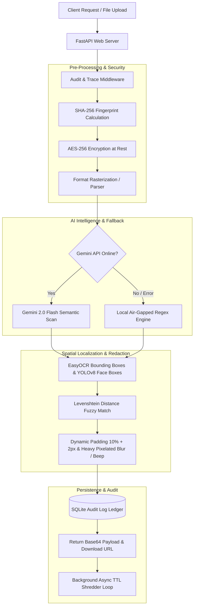

# PII Shield Enterprise - Complete End-to-End Technical & Developer Guide

Welcome to the master technical documentation for **PII Shield Enterprise**. This guide provides an exhaustive, end-to-end deep dive into every single layer of the application: system architecture, technology choices, per-format masking mechanics, production security, database models, background daemons, API routes, frontend components, and cloud scaling strategies.

---

## 📑 Table of Contents
1. [System Overview & Business Core](#1-system-overview--business-core)
2. [Complete Technology Stack & Engine Matrix](#2-complete-technology-stack--engine-matrix)
3. [End-to-End Request Lifecycle & Flowcharts](#3-end-to-end-request-lifecycle--flowcharts)
4. [Deep-Dive Masking Mechanics by File Format](#4-deep-dive-masking-mechanics-by-file-format)
   - [4.1 Images & PDF Documents](#41-images--pdf-documents)
   - [4.2 Levenshtein Distance: Where & Why It Is Used](#42-levenshtein-distance-where--why-it-is-used)
   - [4.3 Biometric Face Blurring (YOLOv8)](#43-biometric-face-blurring-yolov8)
   - [4.4 Audio Processing & Beep Overlays](#44-audio-processing--beep-overlays)
   - [4.5 High-FPS Parallel Video Pipeline](#45-high-fps-parallel-video-pipeline)
   - [4.6 Word & PowerPoint XML Processing](#46-word--powerpoint-xml-processing)
   - [4.7 Spreadsheets (100K+ Row Sampling)](#47-spreadsheets-100k-row-sampling)
   - [4.8 Plain Text Obfuscation Modes](#48-plain-text-obfuscation-modes)
5. [Enterprise Production Infrastructure Code Walkthrough](#5-enterprise-production-infrastructure-code-walkthrough)
   - [5.1 Database Layer (`src/db/database.py`)](#51-database-layer-srcdbdatabasepy)
   - [5.2 AES-256 Security & Encryption (`src/core/security.py`)](#52-aes-256-security--encryption-srccoresecuritypy)
   - [5.3 Async TTL File Shredder (`src/services/ttl_cleaner.py`)](#53-async-ttl-file-shredder-srcservicesttl_cleanerpy)
   - [5.4 Air-Gapped Offline Fallback Engine (`src/services/fallback_engine.py`)](#54-air-gapped-offline-fallback-engine-srcservicesfallback_enginepy)
   - [5.5 Compliance Exporter (`src/services/compliance_reporter.py`)](#55-compliance-exporter-srcservicescompliance_reporterpy)
   - [5.6 Middleware & API Key Auth (`src/middleware/`)](#56-middleware--api-key-auth-srcmiddleware)
   - [5.7 Enterprise REST API Router (`src/api/v1/router.py`)](#57-enterprise-rest-api-router-srcapiv1routerpy)
6. [Frontend Enterprise Workspace Walkthrough](#6-frontend-enterprise-workspace-walkthrough)
7. [Resilience, Rate Limiting & Collision Avoidance](#7-resilience-rate-limiting--collision-avoidance)
8. [DevOps, Security Scanning & Quality Control](#8-devops-security-scanning--quality-control)
9. [Production Cloud Scaling Architecture](#9-production-cloud-scaling-architecture)
10. [Master Interview Q&A Index](#10-master-interview-qa-index)

---

## 1. System Overview & Business Core

### What is PII Shield Enterprise?
PII Shield Enterprise is an AI-powered, full-stack monorepo system engineered to automatically detect and sanitize Personally Identifiable Information (PII) across 7 file format families (Images, PDFs, Word, PowerPoint, Spreadsheets, Audio, Video).

### Compliance Standards Addressed
- **GDPR (Articles 5 & 17)**: Data minimization & zero-retention right to erasure.
- **HIPAA Privacy Rule**: Sanitization of 18 Protected Health Information (PHI) identifiers in medical records and telehealth recordings.
- **CCPA**: Consumer privacy enforcement.
- **SOC 2 Type II**: Immutable audit logging and encrypted storage at rest.

---

## 2. Complete Technology Stack & Engine Matrix

| Layer | Technology | Version | Purpose |
| :--- | :--- | :--- | :--- |
| **Web Server** | FastAPI | 0.110+ | High-throughput ASGI Web Gateway |
| **Frontend Framework** | React + TypeScript + Vite | 19 / 5.9 / 7.0 | Single-Page Application (SPA) |
| **AI LLM Engine** | Google Gemini 2.0 Flash | Cloud API | Multimodal Semantic PII Detection |
| **Computer Vision** | YOLOv8 Nano (`yolov8n.pt`) | PyTorch / ONNX | Real-time Biometric Face Blur |
| **OCR Engine** | EasyOCR / PaddleOCR | PyTorch | Word Bounding Box Localization `(x, y, w, h)` |
| **Database** | SQLite3 (`pii_enterprise.db`) | Embedded | Immutable Audit Ledger & Job State |
| **Encryption** | Fernet AES-256 | Cryptography | Storage at Rest Security |
| **Audio Processing** | `pydub` + `Sine(300)` | Python | Waveform Slicing & 300Hz Sine Beep |
| **Document Processing** | `PyMuPDF`, `python-docx`, `python-pptx`, `pandas` | Python | High-DPI PDF, XML DOM, DataFrame Masking |

---

## 3. End-to-End Request Lifecycle & Flowcharts


```mermaid
graph TD
    A[Client Request / File Upload] --> B[FastAPI Web Server]
    B --> M[Audit & Trace Middleware]
    
    subgraph Pre-Processing & Security
        M --> S1[SHA-256 Fingerprint Calculation]
        S1 --> S2[AES-256 Encryption at Rest]
        S2 --> S3[Format Rasterization / Parser]
    end

    subgraph AI Intelligence & Fallback
        S3 --> AI{Gemini API Online?}
        AI -- Yes --> LLM[Gemini 2.0 Flash Semantic Scan]
        AI -- No / Error --> FB[Local Air-Gapped Regex Engine]
    end

    subgraph Spatial Localization & Redaction
        LLM --> LOC[EasyOCR Bounding Boxes & YOLOv8 Face Boxes]
        FB --> LOC
        LOC --> ALIGN[Levenshtein Distance Fuzzy Match]
        ALIGN --> MASK[Dynamic Padding 10% + 2px & Heavy Pixelated Blur / Beep]
    end

    subgraph Persistence & Audit
        MASK --> DB[(SQLite Audit Log Ledger)]
        DB --> RET[Return Base64 Payload & Download URL]
        RET --> TTL[Background Async TTL Shredder Loop]
    end
```

---

## 4. Deep-Dive Masking Mechanics by File Format

### 4.1 Images & PDF Documents (`image_utils.py` & `pdf_utils.py`)
1. **High-Res 300 DPI Rendering**: PDF pages are rendered into image canvases using PyMuPDF (`fitz`) with a **$300/72 = 4.166\times$ zoom matrix**.
2. **OCR Localization**: EasyOCR extracts pixel coordinates `(x_min, y_min, x_max, y_max)` for all words.
3. **Fuzzy String Alignment**: Matches OCR words with Gemini PII strings using Levenshtein distance ($\text{similarity ratio} \ge 0.85$).
4. **Dynamic Border Padding**: Adds a $10\% + 2\text{px}$ padding box around coordinates.
5. **Heavy Blurring Algorithm**:
   ```python
   def heavy_blur_roi(roi):
       h, w = roi.shape[:2]
       # Downsample ROI to 10% size (physically destroys text pixel details)
       small = cv2.resize(roi, (max(4, int(w * 0.1)), max(4, int(h * 0.1))), interpolation=cv2.INTER_LINEAR)
       # Upsample back (creates blocky shapes)
       pixelated = cv2.resize(small, (w, h), interpolation=cv2.INTER_LINEAR)
       # Apply Gaussian Blur to smooth edges
       return cv2.GaussianBlur(pixelated, (max(5, int(w*0.1)|1), max(5, int(h*0.1)|1)), 0)
   ```

### 4.2 Levenshtein Distance: Where & Why It Is Used
- **WHERE IT IS USED**:
  - **Images (`image_utils.py`)**: Matching visual EasyOCR words against Gemini's detected text list.
  - **PDF Documents (`pdf_utils.py`)**: Page images generated from PyMuPDF use EasyOCR + Levenshtein fuzzy matching.
  - **Video Frames (`video_utils.py`)**: Text frame masking uses EasyOCR + Levenshtein string matching.
  - **PowerPoint Visual Mode (`ppt_utils.py`)**: Slide image renders rely on `process_image` (EasyOCR + Levenshtein).
- **WHY IT IS USED**:
  - Visual OCR engines frequently output minor typos or character misrecognitions (e.g. `'John'` vs `'John'`, or `'I23-45-6789'` vs `'123-45-6789'`). Levenshtein fuzzy matching prevents these minor OCR typos from missing redactions.
- **WHERE IT IS NOT USED**:
  - **Word (`.docx`) & Plain Text (`.txt`)**: Text is extracted directly from clean digital XML text nodes in memory (`doc.paragraphs`), so exact Python string replacement (`para.text.replace(pii_text, replacement)`) is used.
  - **Spreadsheets (`.csv`, `.xlsx`)**: Uses exact Pandas dataframe column indexing and vectorized string transformations.

### 4.3 Biometric Face Blurring (YOLOv8)
Single-pass CNN YOLOv8 (`yolov8n.pt`) detects human faces (`cls == 0`) and applies a heavy $(99, 99)$ Gaussian blur kernel or solid paint box over facial coordinates.

### 4.4 Audio Processing & Beep Overlays (`audio_utils.py`)
1. Gemini transcribes audio and returns word timestamps (`start_time`, `end_time`).
2. `pydub` generates a 300 Hz sine-wave tone: `Sine(300).to_audio_segment(duration=duration_ms)`.
3. Slices audio waveform: `audio[:start_ms] + beep + audio[end_ms:]`.

### 4.5 High-FPS Parallel Video Pipeline (`video_utils.py`)
Frame extraction is parallelized across worker threads using `ThreadPoolExecutor`:
```python
with ThreadPoolExecutor(max_workers=4) as executor:
    futures = [executor.submit(process_single_frame, frame) for frame in frames]
```

### 4.6 Word & PowerPoint XML Processing (`docx_utils.py`, `ppt_utils.py`)
Parses `python-docx` / `python-pptx` paragraph XML DOM trees, substituting target strings inside text runs while preserving formatting.

### 4.7 Spreadsheets (100K+ Row Sampling) (`csv_utils.py`)
Samples 15 representative rows for Gemini to classify column-level PII schemas, then applies local Pandas vectorized regex masking across all 100,000+ rows instantly.

### 4.8 Plain Text Obfuscation Modes (`text_utils.py`)
- **General**: `[MASKED]`
- **Named**: `[Full Name]`, `[Credit Card]`
- **X-Character Mapping**: `XXXX XXXXXX` (length-preserving).

---

## 5. Enterprise Production Infrastructure Code Walkthrough

### 5.1 Database Layer (`src/db/database.py`)
Manages the embedded SQLite file (`pii_enterprise.db`). On app startup, `init_db()` creates:
- `audit_logs`: Records `id`, `timestamp`, `filename`, `file_hash`, `pii_categories`, `masking_type`, `status`, `processing_time_ms`, `file_size_bytes`.
- `api_keys`: Manages hashed authentication keys (`key_hash`, `name`, `role`, `created_at`, `is_active`).
- `job_queue`: Async job tracking (`id`, `status`, `progress`, `result_filename`, `error_message`).

### 5.2 AES-256 Security & Encryption (`src/core/security.py`)
- `calculate_sha256(file_path)`: Generates cryptographic file fingerprints.
- `simple_encrypt_bytes` / `simple_decrypt_bytes`: Encrypts files saved to disk using Fernet AES-256 CBC stream encryption.
- `generate_api_key()`: Creates random API keys (`pii_live_...`) and stores SHA-256 hashes.

### 5.3 Async TTL File Shredder (`src/services/ttl_cleaner.py`)
Runs an async background task (`run_ttl_cleanup_loop`) every 60 seconds, deleting raw and redacted files exceeding `FILE_TTL_SECONDS` (default: 3600s).

### 5.4 Air-Gapped Offline Fallback Engine (`src/services/fallback_engine.py`)
Contains compiled regex patterns matching `Email`, `Phone Number`, `SSN`, `Credit Card`, `IP Address`, `Date of Birth`, `API Key`, `Aadhaar Number`, routing requests locally when Gemini is offline.

### 5.5 Compliance Exporter (`src/services/compliance_reporter.py`)
Generates downloadable HTML/PDF certificates summarizing sanitized records, encryption standards, and file hashes for GDPR/HIPAA audits.

### 5.6 Middleware & API Key Auth (`src/middleware/`)
- `AuditMiddleware`: Computes latency and injects `X-Enterprise-Processing-Time-MS` response headers.
- `auth_middleware.py`: Validates `X-API-Key` headers against SQLite hashes.

### 5.7 Enterprise REST API Router (`src/api/v1/router.py`)
Provides REST endpoints:
- `GET /api/v1/analytics/stats`: Metrics & PII category distribution.
- `GET /api/v1/audit/logs`: Paginated audit log records.
- `GET /api/v1/audit/export`: Compliance certificate exporter.
- `POST /api/v1/batch`: Multi-file parallel batch upload.
- `POST /api/v1/preview`: Human-in-the-loop (HITL) pre-redaction inspector.
- `POST /api/v1/keys`: API Key management.

---

## 6. Frontend Enterprise Workspace Walkthrough

1. **[Interactive Workbench (`/`)](file:///d:/pii%20masking/pii-masking-frontend-master/src/pages/main/Page.tsx)**: Single-file upload workspace with category selectors.
2. **[Batch Processing (`/batch`)](file:///d:/pii%20masking/pii-masking-frontend-master/src/pages/batch/BatchProcessingPage.tsx)**: Multi-file drag & drop queue.
3. **[HITL Review Queue (`/preview`)](file:///d:/pii%20masking/pii-masking-frontend-master/src/pages/preview/HITLPreviewWorkbench.tsx)**: Pre-redaction inspector for compliance verification.
4. **[Audit Ledger (`/audit`)](file:///d:/pii%20masking/pii-masking-frontend-master/src/pages/audit/AuditLogsPage.tsx)**: Searchable audit table with compliance certificate exporter.
5. **[Analytics Dashboard (`/analytics`)](file:///d:/pii%20masking/pii-masking-frontend-master/src/pages/analytics/AnalyticsDashboard.tsx)**: Visual charts showing throughput, latency, and category breakdown.

---

## 7. Resilience, Rate Limiting & Collision Avoidance

- **Gemini Exponential Backoff** (`gemini_utils.py`): Doubles sleep time (`2^attempt`) on HTTP 429 errors.
- **Filename Collision Prevention**: Appends UUID v4 + epoch timestamp (`a1b2c3d4_1719827361_invoice.pdf`).
- **Levenshtein Safety Threshold**: Requires 85% match ratio ($\ge 0.85$), enforcing 100% exact match for short words ($\le 3$ chars).

---

## 8. DevOps, Security Scanning & Quality Control

- **Gitleaks**: Secrets scanner preventing key leaks in git commits.
- **Ruff**: High-speed Python linter enforcing PEP 8.
- **Bandit**: Static security scanner detecting Python vulnerabilities.
- **Semgrep**: Static analysis checking FastAPI route security.
- **Verification**: Tested via Pytest, `tsc --noEmit`, and `py_compile`.

---

## 9. Production Cloud Scaling Architecture

To scale to 1,000,000 files/day:
1. **Kubernetes Cluster**: Deploy FastAPI as stateless Docker pods with Horizontal Pod Autoscaling (HPA).
2. **Distributed Task Queue**: Replace local job queue with **Celery + Redis / RabbitMQ** workers for GPU video/OCR processing.
3. **Cloud Object Storage**: Move local files to **AWS S3** with S3 Lifecycle zero-retention policies.
4. **Database & Caching**: Transition SQLite to **AWS Aurora PostgreSQL** with read-replicas, using Redis for deduplication caching.

---

## 10. Master Interview Q&A Index

For the full **35-question master interview reference**, visit:
👉 **[Master Interview Q&A Guide (`INTERVIEW_QA.md`)](file:///d:/pii%20masking/INTERVIEW_QA.md)**
