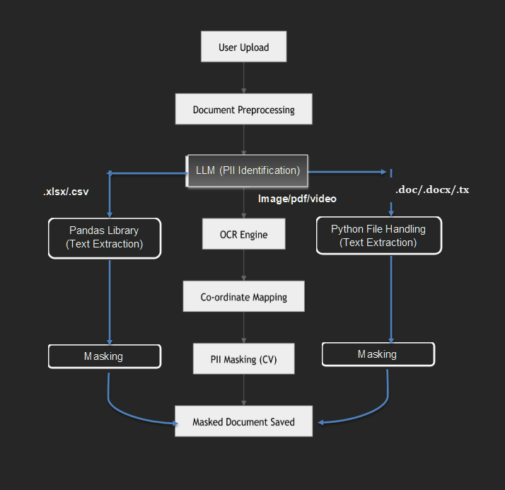

# PII Obfuscation System

## Introduction

Personally Identifiable Information (PII) Masking is a process used to protect sensitive data by detecting and anonymizing PII elements in documents. This document outlines the workflow, components, implementation details, and business impact of the PII Masking process.

---

## Objective

Develop an AI-powered PII Obfuscation System that scans digital documents and automatically blurs or masks Personally Identifiable Information (PII). This prototype, built by Ascentt's AI Solution Factory (AISF), will ensure data privacy and regulatory compliance while preserving document readability and usability.

---

## Problem Statement

Organizations handle vast amounts of sensitive data, exposing them to data breaches, compliance risks, and privacy concerns. Manual obfuscation or masking is error-prone and inefficient. The PII Obfuscation System will provide an automated, accurate, and scalable solution for real-time PII detection and obfuscation across digital documents.

---

## Scope of the Prototype

### 1. Data Processing with Digital Document, Video, and Audio Handling

- Supports pdf files, MS-word files, images, spreadsheets, plain text files, video, and audio.
- Extracts and analyzes textual content using LLM, NLP techniques, and OCR (Optical Character Recognition) for digital documents.

### 2. Categories under PII Detection

Uses AI-driven techniques to identify PII attributes. Detects the following PII attributes:

#### Biographical Data
- Name
- Gender
- Contact Number
- Email Address
- Date of Birth
- Address
- Driver's License Number
- Aadhaar Number
- Citizenship or Immigration Status
- Ethnic or Religious Affiliation

#### Financial Data
- Social Security Number (SSN)
- Tax Identification Number (PAN)
- Bank Account Number
- Any Account Passwords
- Health Insurance Data
- Policy Number
- Subscriber ID
- Medical Information on Bills

### 3. Obfuscation Techniques

Below are the masking techniques for images, video, and scanned or digital PDFs.

| PII Data | Masking Technique | Description | Example |
|----------|-------------------|-------------|---------|
| Blurring | Overlapping PII data with blurriness | My name is Fred Johnson becomes | My name is [blurred text] |
| Rectangular Bounding Box | Replacing PII data with a yellow-coloured rectangular box | My name is Fred Johnson becomes | My name is XXXX XXXXXXX |

Below are the masking techniques for text data present in text-based documents.

| PII Data | Masking Technique | Description | Example |
|----------|-------------------|-------------|---------|
| Replacement | Replacing PII with a fixed word | My name is Fred Johnson becomes | My name is [REDACTED] |
| Size-preserving replacement | Replacing PII with a value (X) of equal length | My name is Fred Johnson becomes | My name is XXXX XXXXXXX |
| Named/numbered replacement | Replacing PII with an identifying label | My name is Fred Johnson becomes | My name is [FULLNAME] |

**Note**: For Audio files, the beep-beep-beep sound will be used to mask the PII data.

### 4. User Interface and API Integration

- Web-based dashboard for document upload, preview, and download masked document.
- We are providing drop down menu option to the user to select the masking technique depending upon the uploaded document to mask.

---

## Technologies Used

- **Generative AI**: LLM (Gemini 2.0 Flash) for PII data detection and extraction
- **OCR**: Tesseract/Paddle/Easy to locate and extract PII text co-ordinates
- **Pandas & Python File Handling**: Masking for text-based documents
- **Computer Vision**: OpenCV for masking PII data in images and videos
- **PyDub Python Library**: Masking the audio PII data

---

## Flow Block Diagram

<!-- Insert Flow Block Diagram here -->

*Fig.1: Flow Block Diagram of PII Obfuscation System*

---

## Business Impact

- **Enhanced Data Security**: Reduces risks associated with data breaches.
- **Regulatory Compliance**: Helps organizations adhere to legal data protection standards.
- **Operational Efficiency**: Automates PII detection and masking, reducing manual work.
- **User Trust**: Strengthens customer confidence in handling sensitive information.

---

## Conclusion

This document provides an overview of the structured workflow, technologies used, compliance aspects, and business benefits of implementing an effective PII masking system.
